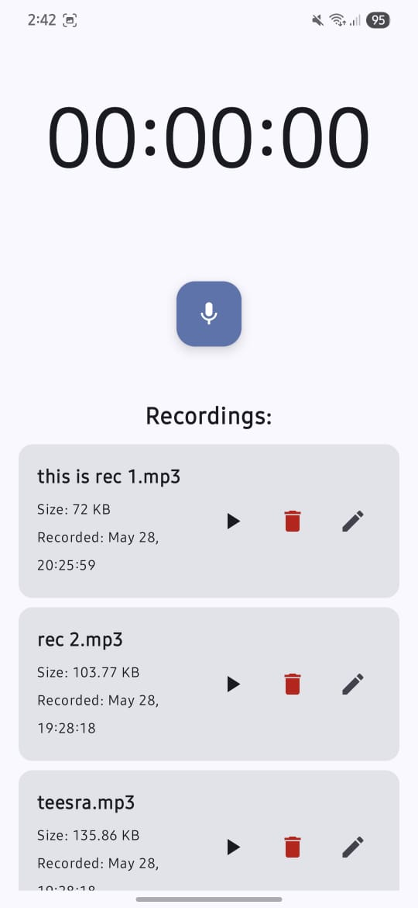
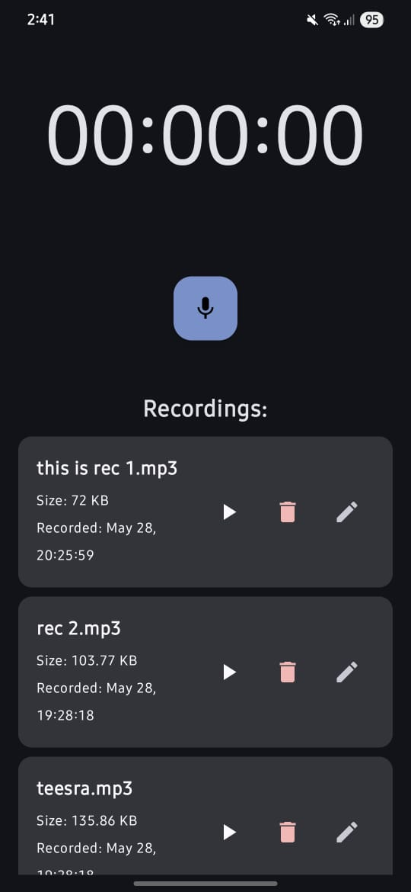
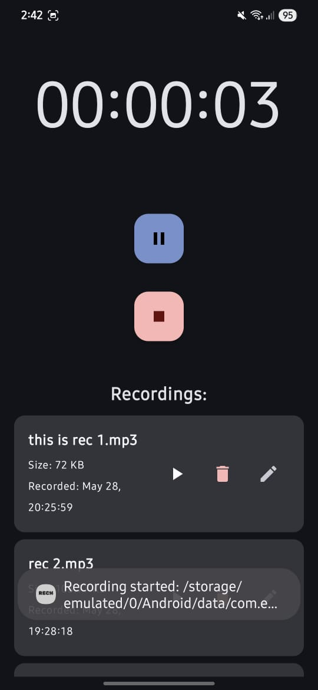
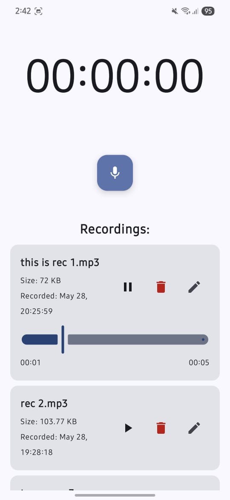
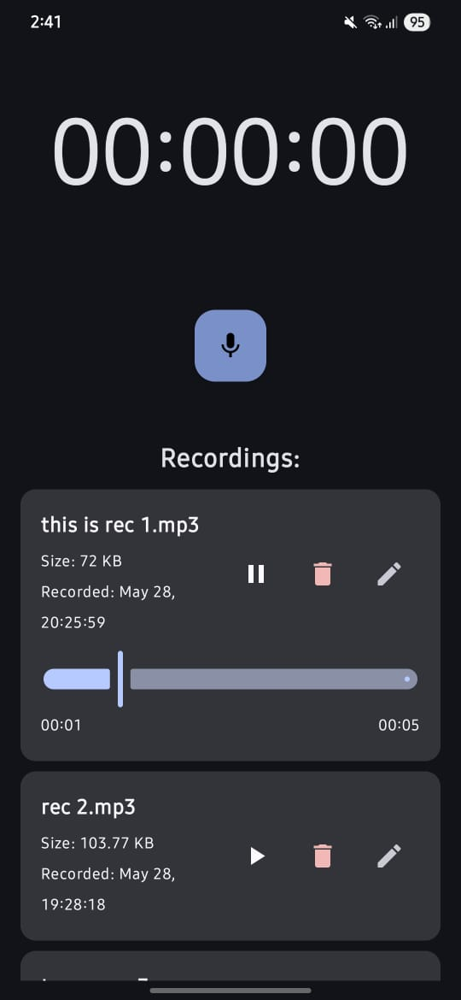
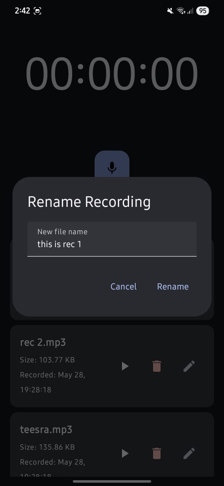

# RECh

RECh is a modern Android voice recording app built with Jetpack Compose. It features a clean architecture, real-time recording feedback, robust file handling, and a beautifully responsive Material 3 design. Whether you're capturing ideas, interviews, or voice notes, RECh provides a smooth and intuitive experience.

---

## ✨ Features

- 🎧 **Core Recording & Playback**
  - Start, pause, resume, and stop audio recording
  - Play recorded files with playback controls

- ⏱ **Real-time Feedback**
  - Live recording duration display
  - Interactive playback progress slider with seek functionality

- 📂 **File Management**
  - List, rename, and delete recorded audio files easily

- 🎨 **Modern UI/UX**
  - Built with Jetpack Compose and Material 3
  - Dynamic theming with Material You color support

- 🧠 **Robust Audio Handling**
  - Uses `MediaRecorder` and `MediaPlayer` APIs
  - Proper lifecycle and resource management to avoid common pitfalls

- 🔐 **Permission Handling**
  - Graceful runtime microphone permission requests

- 🧱 **Clean Architecture**
  - Clear separation of concerns (UI, recording, playback, file logic)
  - Reactive state management with Kotlin Flows

---

## 📸 Screenshots

### 🏠 Home Screen – Light Mode

### 🏠 Home Screen – Dark Mode

### 🎙️ Recorder View

### ▶️ Player View dark mode

### ▶️ Player View light mode

### ✏️ Rename View

---

## 🛠️ Tech Stack

- **Kotlin**
- **Jetpack Compose**
- **Material 3 + Material You**
- **Kotlin Flows**
- **MediaRecorder / MediaPlayer APIs**

---
## 🙌 Author

Made with ❤️ by [Hariom Sharnam](https://github.com/variable005) 

